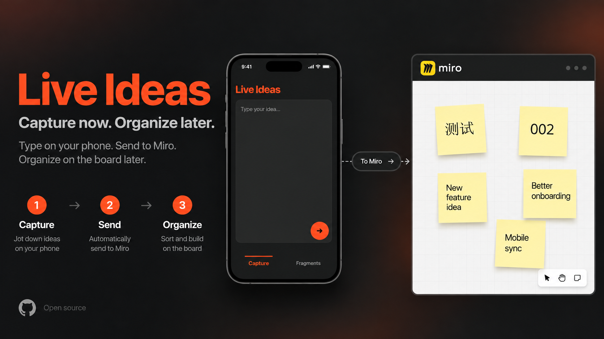

<p align="center">
  <a href="./README.md">English</a> · <strong>简体中文</strong> · <a href="./README.ja.md">日本語</a>
</p>

# Live Ideas

**把手机里输入的文字直接发送到指定 Miro Board。**

## 怎么用

**01 — 输入**  
打开 Live Ideas，写下想法。

**02 — 发送**  
点击 Send。

**03 — Miro**  
文字会作为 Sticky Note 出现在你配置好的 Miro Board 中。

就这么简单。

发送失败时，原文会保留，可以直接 Retry。**Fragments** 会在当前设备保存已成功发送的本地历史。

## 使用

- [中文使用教程](./docs/USAGE.zh-CN.md)
- [English usage guide](./docs/USAGE.md)
- [日本語の使い方](./docs/USAGE.ja.md)
- [Setup & deployment](./docs/SETUP.md)

## Quick start

需要 Node.js **22.13+**、拥有 `boards:read` / `boards:write` 权限的 Miro Token，以及一个目标 Miro Board。

```bash
git clone https://github.com/Dachi2333/live-ideas.git
cd live-ideas
npm ci
npm test
npm run build
```

自部署请参考 [Setup & deployment](./docs/SETUP.md)。Miro 凭证只保存在服务端，不会进入浏览器 JavaScript。

## Docs

[Architecture](./docs/ARCHITECTURE.md) · [Security](./docs/SECURITY.md) · [PRD](./docs/PRD.md) · [项目大纲](./docs/OUTLINE.md)

## License

MIT — 见 [LICENSE](./LICENSE)。

---

<sub>Live Ideas 是独立开源项目，与 Miro 无隶属关系。</sub>
